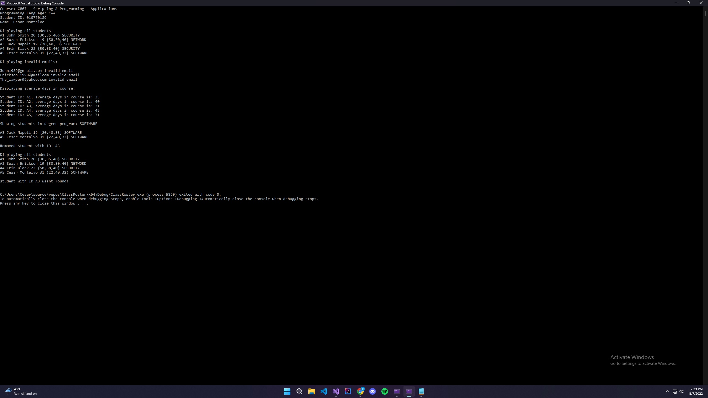

A program that parses a list of student data that creates student objects that are able to be manipulated and viewed. It also creates a class roster to store students in an array and has some specific data realated output that prints to the console.

